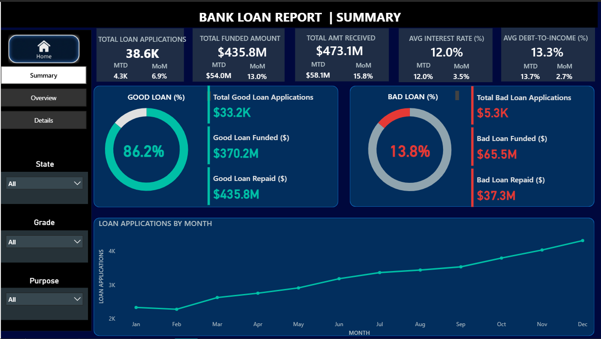

# Bank Loan Performance & Default Prediction — Capstone Project  

This project analyzes consumer loan data to track loan performance and identify default risk.  
It demonstrates end-to-end skills across **SQL, Python and Power BI**, with GDPR-safe sample data.  

---

## 📊 Power BI Dashboard Preview — Bank Loan Report | Summary  

**Key Insights**
- Total Loan Applications: **38.6K**
- Total Funded: **$435.8M**
- Total Repaid: **$473.1M**
- Avg Interest Rate: **12%**
- Default Rate: **13.8%**
- Loan risk split: **Loan risk split: 86% performing loans vs 14% defaults**
- Loan Applications Trend shows steady growth  

---

## 🔑 Deliverables  
- **SQL** → Database schema, KPIs, queries (`/sql`)  
- **Python (Jupyter)** → EDA, preprocessing, visualizations (`/reports`)  
- **Power BI** → Loan Performance Dashboard (`/powerbi`)  
- **Excel** → Pivot-based dashboards (WIP)  
- **Data** → Anonymized sample dataset (`/data/inspected`)  

---

## 🛠 Tech Stack  
- **SQL Server** (database + queries)  
- **Python** (pandas, matplotlib, seaborn)  
- **Power BI** (interactive dashboard)   
- **Git & GitHub** (branch workflow)  

---

## 📂 Repo Structure

data/raw/         # full dataset (ignored, not in repo)  
data/inspected/   # safe preview sample (committed)  
docs/             # notes, data dictionary, privacy docs  
sql/              # schema + import scripts  
reports/          # EDA & QC reports  
notebooks/        # exploratory analysis  

---

## 📌 About this Project
- **Type**: Capstone (portfolio-ready)   
- **Focus**: End-to-end loan performance analysis • Reproducibility • GDPR/privacy awareness

---

For detailed day-by-day updates, see [/docs/progress_log.md](docs/progress_log.md)