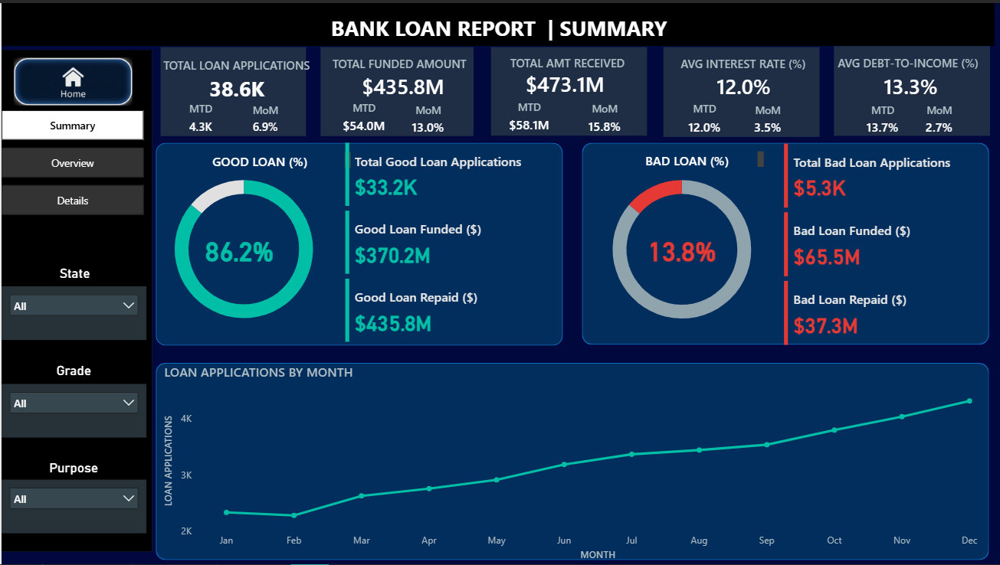
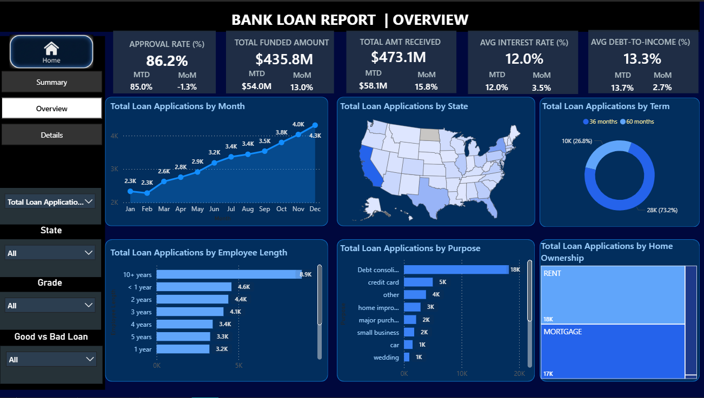
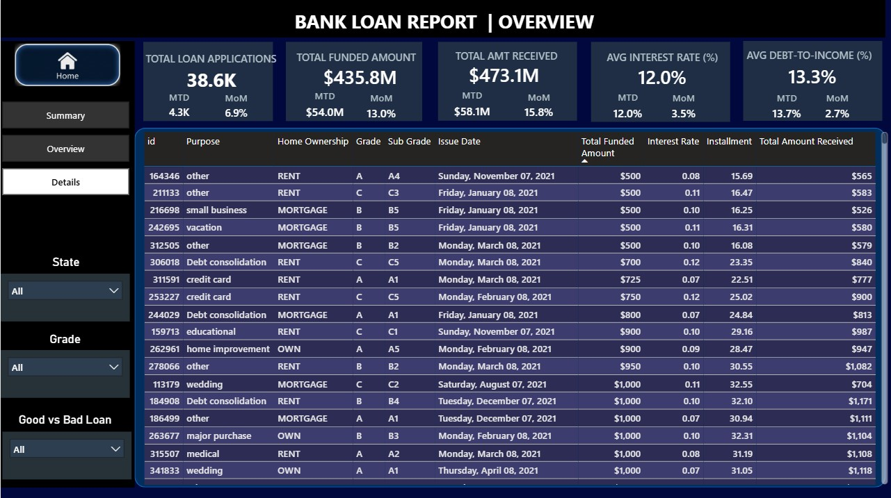

# Bank Loan Performance and Default Analysis
 
Consumer loan performance and portfolio risk analysis using SQL, Python, and Power BI on anonymized data.

---

## Power BI Dashboard Preview 

### Summary View

### Overview View

### Details View

**Key Insights**
- Total Loan Applications: **38.6K**
- Total Funded: **$435.8M**
- Total Repaid: **$473.1M**
- Avg Interest Rate: **12%**
- Default Rate: **13.8%**
- Loan risk split: **86% performing loans vs 14% defaults**
- Loan Applications Trend shows steady growth

---

## Deliverables
- **SQL** → Database schema, KPIs, queries (`/sql`)
- **Python (Jupyter)** → EDA, preprocessing, visualizations (`/reports`)
- **Power BI** → Loan Performance Dashboard (`/powerbi`)
- **Excel** → Pivot-based dashboards 
- **Data** → Anonymized sample dataset (`/data/inspected`)

---

## Tech Stack
- **SQL Server** (database + queries)
- **Python** (pandas, matplotlib, seaborn)
- **Power BI** (interactive dashboard)
- **Git & GitHub** (branch workflow)

---

## Repo Structure

data/raw/         # full dataset (ignored, not in repo)  
data/inspected/   # safe preview sample (committed)  
docs/             # notes, data dictionary, privacy docs  
sql/              # schema + import scripts  
reports/          # EDA & QC reports  
notebooks/        # exploratory analysis  

---

## About this Project
- **Type:** Capstone (portfolio-ready)
- **Focus:** End-to-end loan performance analysis • Reproducibility • GDPR/privacy awareness

---

## Analysis Scope & Interpretation

This analysis is based on **final loan outcomes** only (Fully Paid, Charged Off, Current), without event-level delinquency or default timestamps.  
Accordingly, insights are scoped to **ex-post portfolio monitoring and outcome comparison**, not lifecycle or time-to-default modeling.  
Any early-warning or hazard-based analysis would require **event-level data** (e.g., payment history or default dates).

---

For detailed phase-wise updates, see [/docs/progress_log.md](docs/progress_log.md)
